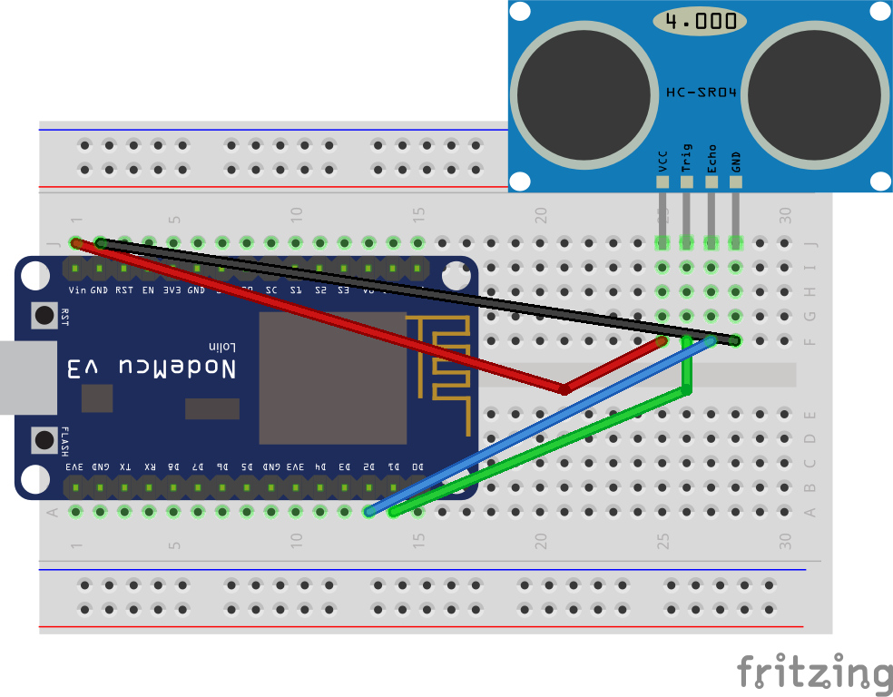

# esp8266-ultrasonic
Contoh penggunaan sensor ultrasonic menggunakan esp8266 amica

## Skematik
Untuk design skematik dapat digambarkan di bawah ini

Design dalam format fritzing dapat diambil di [esp8266-hc-sr04.fzz](esp8266-hc-sr04.fzz)

## Koneksi eps8266 dan sensor ultrasonik
Dari gambar di atas dapat dilihat pengkabelan seperti pada tabel di bawah ini

| ESP8266 Amica | Sensor Ultrasonic                  |
|---------------|------------------------------------|
| VCC           | Vcc                                |
| GND           | Gnd                                |
| D1            | Trig                               |
| D2            | Echo                               |
